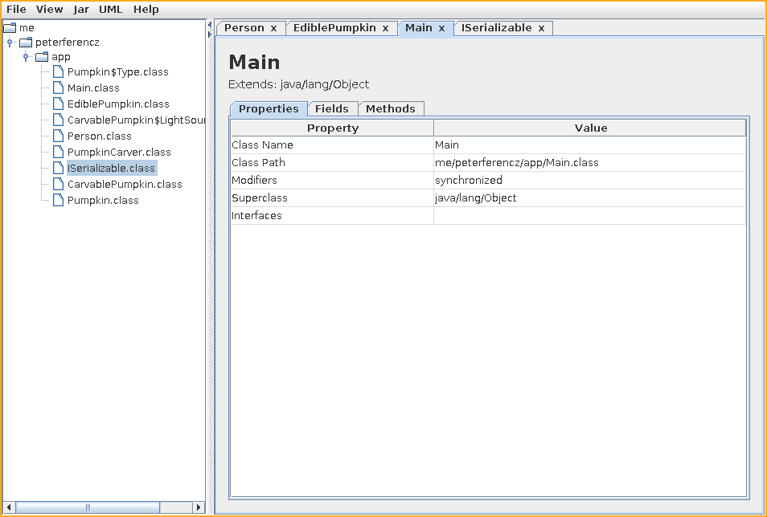
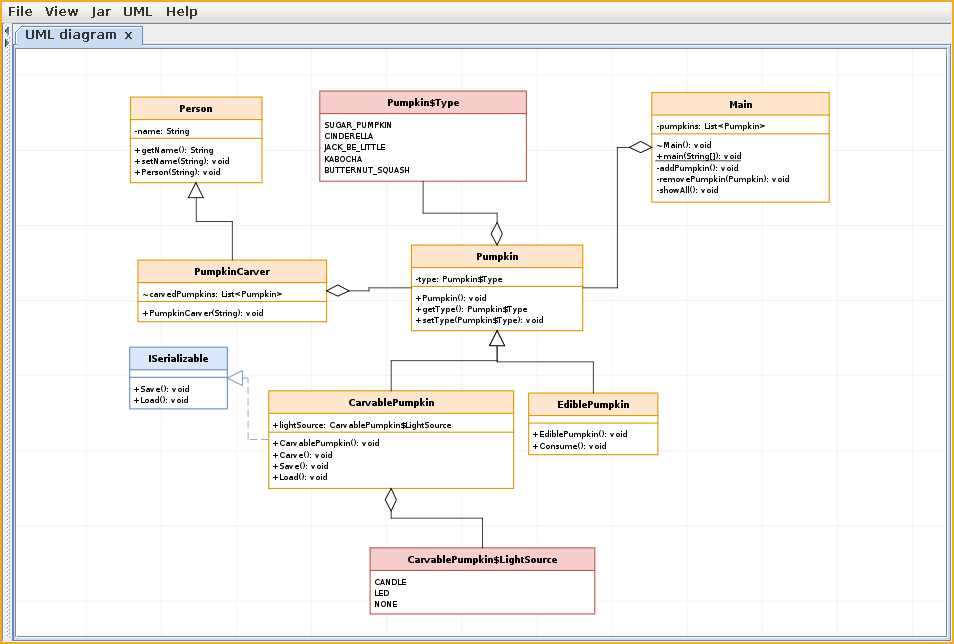

# Java Archive Explorer & UML Visualizer
> Made for Budapest University of Technology and Economics | Faculty of Electrical Engineering and Informatics | BSc Computer Science and Engineering | Basics of Programming 3 (BMEVIIIAB00)

`Jar explorR` is a lightweight Java tool designed for exploring .jar files,
inspecting class contents, and generating UML diagrams.

## Gallery




## Features

- Inspect JAR file contents
- Discover classes and interfaces
- Extract inheritance hierarchies
- Generate and export UML class diagrams
- Lightweight CLI interface

## Documentation ['HU']
[./docs/specification.pdf](./docs/specification.pdf)

### Build
Built using the maven build system
```bash
mvn clean package
```

## Usage

```bash
java -jar explorr.jar archive.jar
```
